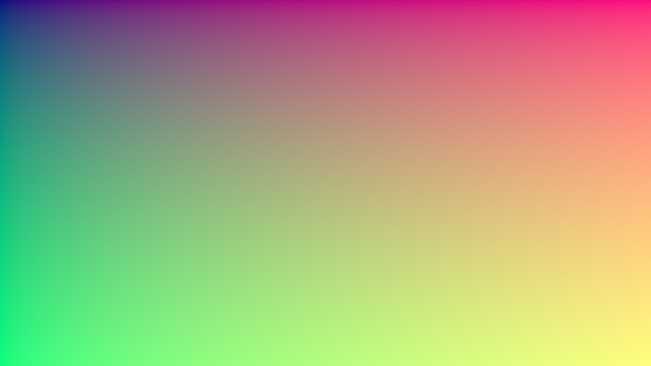

# go-pbrt

Raytracing adventures in Go

## Current output

## To-dos

- HDR for more realistic ligh
- BVH trees for faster intersection tests
  - Surface area heuristics
  - [Approximate agglomerative clustering](http://graphics.cs.cmu.edu/projects/aac/aac_build.pdf)
- Radiance in favor of RGB channels
  - Go generics (?)
- Consider SIMD/AVX
