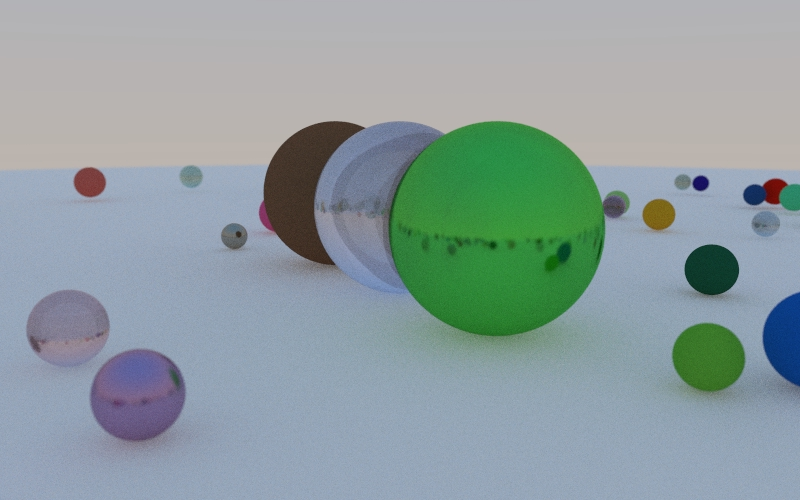

# go-pbrt

Raytracing adventures in Go

## Current output

## To-dos

- HDR  for more realistic ligh
- BVH trees for faster intersection tests
  - Surface area heuristics
- Radiance in favor of RGB channels
  - Go generics (?)
